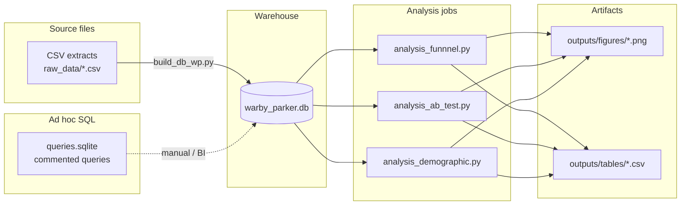
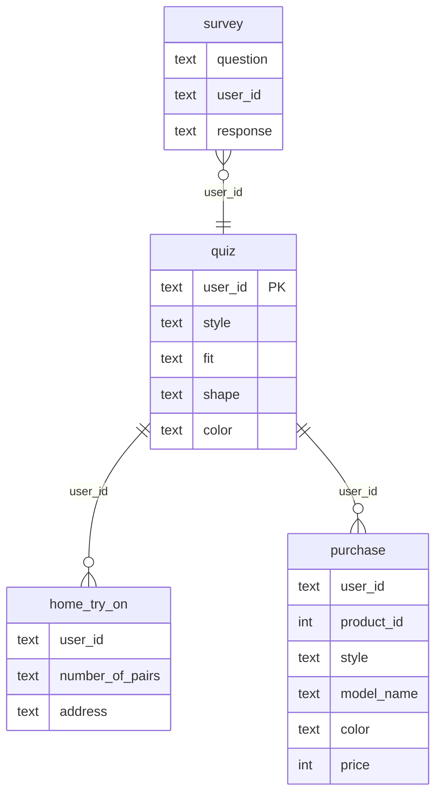

# Eyewear funnel analytics

End-to-end analytics pipeline for a direct-to-consumer eyewear onboarding and purchase funnel. The system ingests staged event-style tables, materializes a query-optimized SQLite warehouse, runs reproducible SQL and Python analyses, and exports figures and metric tables for reporting.

The underlying dataset is **synthetic** and supplied for educational use (Codecademy case study styled after Warby Parker). Metrics illustrate pipeline mechanics and are not production business KPIs.

---

## System overview



---

## Data model

Identifiers align on `user_id` across all fact tables. The quiz table represents one finalized profile per user; `survey` holds granular question-level responses.



**Table roles**

| Table | Role |
|--------|------|
| `survey` | Long-form quiz interactions: one row per user per question. |
| `quiz` | One row per user: consolidated preferences after quiz completion. |
| `home_try_on` | Home try-on program enrollment and variant (`3 pairs` / `5 pairs`). |
| `purchase` | Purchase events; defines the funnel terminal conversion state. |

---

## Repository layout

| Path | Purpose |
|------|---------|
| `raw_data/*.csv` | Authoritative extracts loaded into the warehouse. |
| `raw_data/build_db_wp.py` | Idempotent loader: CSV → SQLite tables plus join indexes on `user_id`. |
| `warby_parker.db` | Generated SQLite database consumed by all Python jobs. |
| `queries.sqlite` | UTF-8 SQL workbook: survey completion, user-level funnel flags, and rolled-up conversion rates (ad hoc / documentation). |
| `analysis_funnnel.py` | Core funnel metrics, survey aggregation, Plotly funnel charts, `conversion_rates.csv`. |
| `analysis_ab_test.py` | Home try-on variant summary and Matplotlib bar chart of purchase rate by `number_of_pairs`. |
| `analysis_demographic.py` | Purchase conversion by `quiz.style` (Plotly bar + CSV). |
| `outputs/figures/` | Rendered PNG charts. |
| `outputs/tables/` | Exported metric tables for dashboards or decks. |
| `wp_deliverable.pdf` | Consolidated presentation of results. |

---

## Requirements

- Python 3.10+ recommended  
- Packages: `pandas`, `plotly`, `matplotlib`, `kaleido` (static export for Plotly)

Example environment setup:

```bash
python -m venv .venv
source .venv/bin/activate   # Windows: .venv\Scripts\activate
pip install pandas plotly matplotlib kaleido
```

---

## Build and run

**1. Build or refresh the warehouse** (run from `raw_data` so relative CSV paths resolve):

```bash
cd raw_data && python build_db_wp.py && cd ..
```

The script replaces tables in `warby_parker.db`, creates indexes on `quiz(user_id)`, `home_try_on(user_id)`, `purchase(user_id)`, and `survey(user_id)`, and commits.

**2. Execute analyses** from the repository root (where `warby_parker.db` lives):

```bash
python analysis_funnnel.py
python analysis_ab_test.py
python analysis_demographic.py
```

All jobs open the database with `sqlite3.connect`, use `try` / `finally` to close connections, and write under `outputs/`.

---

## Analytical modules

### `analysis_funnnel.py`

- **`build_user_funnel`**: Left joins `quiz` → `home_try_on` → `purchase`; emits `is_home_try_on`, `number_of_pairs`, `is_purchase` per quiz user.  
- **`compute_funnel_metrics`**: Stage counts and rates: Quiz → Home Try-On, Home Try-On → Purchase, Quiz → Purchase (guards division by zero).  
- **`build_survey_funnel`**: `COUNT(DISTINCT user_id)` grouped by `question`, ordered descending by volume.  
- **`plot_conversion_funnel` / `plot_survey_funnel`**: Plotly funnels; static PNG via `write_image` (Kaleido).  
- **Outputs**: `outputs/figures/conversion_funnel.png`, `outputs/figures/survey_completion_funnel.png`, `outputs/tables/conversion_rates.csv`.

### `analysis_ab_test.py`

- Reuses the same user-level funnel SQL as the funnel job.  
- **`summarize_ab_test`**: Filters to `is_home_try_on == 1`, groups by `number_of_pairs`, aggregates users and purchasers, computes `purchase_rate`.  
- **`plot_ab_test`**: Matplotlib bar chart with rate labels; saves at 300 DPI.  
- **Outputs**: `outputs/figures/ab_test_purchase_rate.png`, `outputs/tables/ab_test_summary.csv`.

### `analysis_demographic.py`

- **`compute_style_conversion`**: SQL CTE `purchase_flag` then `GROUP BY quiz.style` for users, purchasers, and `conversion_rate`.  
- **`plot_style_conversion`**: Plotly bar chart with category-specific colors and percentage text.  
- **Outputs**: `outputs/figures/conversion_by_style_preference.png`, `outputs/tables/conversion_by_style_preference.csv`.

### `queries.sqlite`

Commented SQL for:

- Survey completion with percentage relative to the earliest question’s reach.  
- Distinct user funnel flags including `number_of_pairs`.  
- Single-row aggregate conversion rates via a `WITH funnel` CTE and `NULLIF` for safe division.

Execute blocks in any SQLite client against `warby_parker.db`.

---

## Outputs (generated)

| Artifact | Producer |
|----------|----------|
| `outputs/figures/conversion_funnel.png` | `analysis_funnnel.py` |
| `outputs/figures/survey_completion_funnel.png` | `analysis_funnnel.py` |
| `outputs/tables/conversion_rates.csv` | `analysis_funnnel.py` |
| `outputs/figures/ab_test_purchase_rate.png` | `analysis_ab_test.py` |
| `outputs/tables/ab_test_summary.csv` | `analysis_ab_test.py` |
| `outputs/figures/conversion_by_style_preference.png` | `analysis_demographic.py` |
| `outputs/tables/conversion_by_style_preference.csv` | `analysis_demographic.py` |

---

## Operational notes

- **Working directory**: Python entrypoints assume the project root for `DB_PATH = "warby_parker.db"`; the loader assumes `raw_data/` as cwd.  
- **Reproducibility**: Re-running loaders and scripts overwrites tables and output files deterministically for a fixed input CSV set.  
- **Visualization stack**: Plotly figures require Kaleido for PNG export; the A/B module uses Matplotlib only.

---

## License and data

Dataset copyright and usage terms follow the original course materials. This repository implements analysis code and documentation only.
